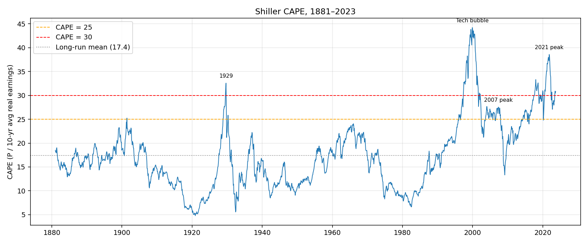
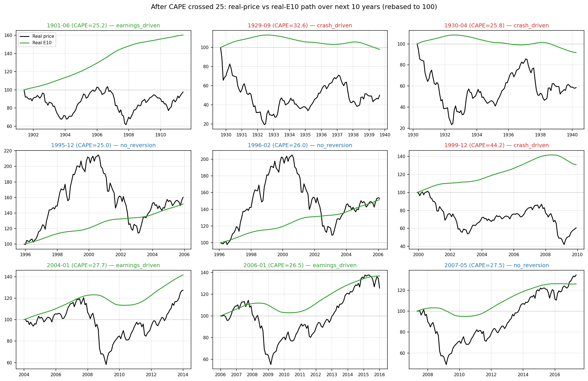
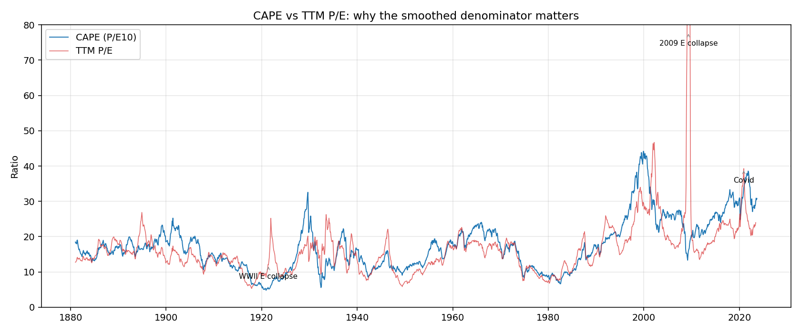
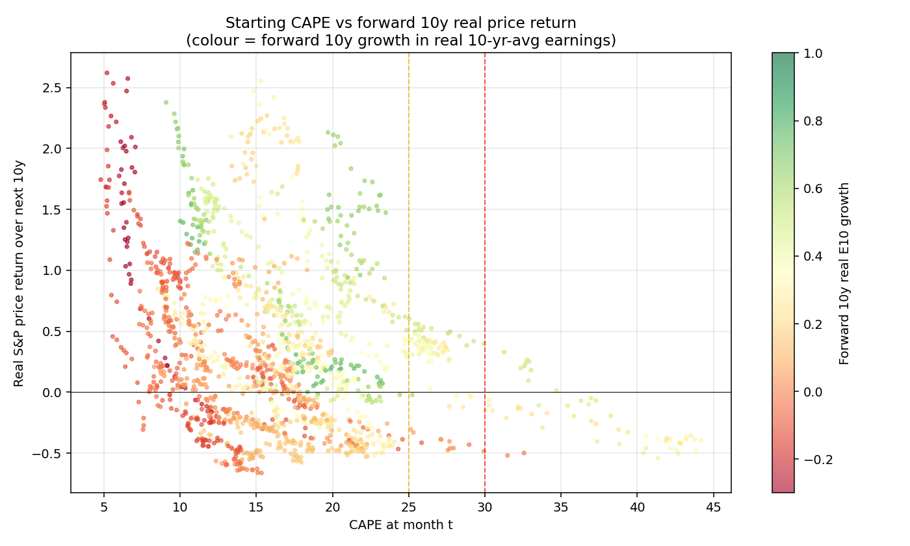

# When CAPE / P/E is high, do markets crash — or do earnings catch up?

**Question.** When the Shiller CAPE (or trailing P/E) is elevated, the
implied long-run return is low. There are two ways the ratio can mean
revert:

1. **Numerator path ("crash"):** the price falls, often because reported
   earnings disappoint and multiples compress.
2. **Denominator path ("growth"):** earnings rise enough that the same
   (or higher) price corresponds to a more modest multiple.

Which actually happens? This note answers it empirically using Robert
Shiller's monthly U.S. dataset back to 1881.

---

## TL;DR

- High CAPE (>= 25) has occurred in **13 distinct episodes since 1881**.
  Of the 9 episodes where we have a full 10-year follow-on window, the
  CAPE-reversion mechanism splits roughly evenly:
  **3 crash-driven, 3 earnings-driven, 3 no-reversion** (price kept rising).
- **Extreme CAPE (>= 30) is much more dangerous.** Of the 4 episodes with
  a complete 10-year window (1929, 1999, 2001, 2002), **all 4 saw a
  drawdown deeper than -45% in real terms** and **all 4 had negative
  10-year real price returns** at the median (-27%).
- The famous TTM-P/E "crashes after earnings disappoint" pattern is real
  but largely a **TTM-P/E artefact**: when E collapses in a recession,
  P/E spikes to absurd levels (e.g. 2009: P/E_TTM ~ 70 even after the
  crash). CAPE, which uses a 10-year smoothed denominator, is immune to
  this and is therefore a cleaner signal.
- The **mechanism depends on starting valuation**: at CAPE 25–28, both
  price-down and earnings-up endings are common (think 2004, 2006). At
  CAPE >= 30, the historical record strongly favours a price crash.
- Important caveat: only **3 truly extreme observations** (1929, 1999,
  and the early-2000s tail) exist in the >=30 bucket. Statistical power
  is low. Treat directional findings, not point estimates.

See full data at [data/shiller_clean.csv](data/shiller_clean.csv) and per-episode
breakdown at [output/episodes_cape_ge_25.csv](output/episodes_cape_ge_25.csv) and
[output/episodes_cape_ge_30.csv](output/episodes_cape_ge_30.csv).

---

## Method

### Data
- Source: Robert Shiller's `ie_data.xls` (Yale).
- Coverage: monthly, January 1871 to September 2023 (1,833 rows).
- We use: nominal `P`, `D`, `E`; CPI; long rate `GS10`; real `P` and real `E`;
  CAPE column. We recompute CAPE = `RealPrice / mean(RealEarnings, 120m)` and
  match Shiller's published series to within a median absolute error of 0.03.

### The decomposition (why it is exact)
By construction `CAPE_t = RealPrice_t / RealE10_t`, so

$$
\log\frac{CAPE_{t+h}}{CAPE_t} \;=\; \log\frac{P^{r}_{t+h}}{P^{r}_t} \;-\; \log\frac{E10^{r}_{t+h}}{E10^{r}_t}
$$

i.e. **any change in CAPE is exactly real-price growth minus real-E10 growth**.
This isn't a model — it's an identity. So at any horizon we can attribute
the realised CAPE move to its two components without any assumption.

### Episode definition
- A month is *elevated* if CAPE ≥ threshold (we run 25 and 30).
- Consecutive elevated months are merged into one *episode*, indexed by
  the **CAPE peak inside the run**.
- For each episode we look forward 3, 5, and 10 years and compute:
  - real S&P price return,
  - real E10 (10-yr-avg real earnings) growth,
  - peak-to-trough max drawdown of real price,
  - mechanism classification (below).

### Mechanism classification (10-year horizon)
| Label | Rule |
|---|---|
| `crash_driven` | Real price fell ≥15% **and** price contributed ≥60% of the absolute log change in CAPE |
| `earnings_driven` | Real price did **not** fall ≥15% **and** real E10 grew ≥15% **and** price contributed <40% |
| `no_reversion` | CAPE was higher 10y later (price grew faster than E10 — re-rating, not de-rating) |
| `mixed` | Some reversion, but neither side dominates |
| `incomplete` | Dataset doesn't extend 10 years past the peak |

Thresholds (15%, 60%/40%) are deliberate but arbitrary — see DECISIONS.

---

## Findings

### 1. Big picture: CAPE is mean-reverting, but slowly and through both channels



Long-run CAPE mean is ~17. CAPE has spent most of the post-1990 era
above its long-run mean. Crossing 25 from below has happened only ~13
times in 140+ years.

### 2. Per-episode decomposition: the picture is heterogeneous



Reading the panels (real price = black, real E10 = green, both rebased to
100 at the CAPE peak):

- **1901, 2004, 2006 → earnings-driven.** Real E10 rose 33–60% over the
  next decade while price drifted sideways or only modestly recovered.
  CAPE compressed because the denominator caught up.
- **1929, 1930, 1999 → crash-driven.** Real price fell 40–64% over the
  next decade. Earnings were weak too (1929: E10 actually declined; 1999:
  E10 grew 31% but price still fell 39%).
- **1995, 1996, 2007 → no reversion at 10y.** Markets melted up further
  from already-elevated levels. The 1995/96 case is the clearest example
  of a "high P/E was justified" outcome; price tripled before the bubble
  popped, and 10 years on price was still 50–90% above the start.

### 3. Extreme CAPE (>= 30): historically much more hazardous

For CAPE ≥ 30 with a complete 10-year window:

| Peak | CAPE | 10y real price ret | 10y real E10 growth | Max drawdown | Mechanism |
|---|---|---|---|---|---|
| 1929-09 | 32.6 | -50% | -2% | -81% | crash |
| 1999-12 | 44.2 | -39% | +31% | -58% | crash |
| 2001-12 | 30.5 | -15% | +27% | -45% | mixed |
| 2002-03 | 30.3 | -6% | +30% | -45% | earnings (just barely) |

100% of these cases had a >40% real drawdown within 10 years. Median
10-year real price return was -27%. Even when earnings did grow strongly
(1999, 2001, 2002), price still fell — the starting multiple was simply
too high to be rescued.

### 4. The TTM P/E "crash after earnings disappointment" story is mostly a denominator artefact



TTM P/E spikes to extraordinary levels (60–120+) in three places: the
post-WWI deflation, the 2008–09 GFC, and Covid. In all three the price
had **already fallen heavily** — the spike is the denominator (E)
collapsing faster than the numerator. Using TTM P/E as a *predictor* of
crashes mostly tells you about earnings cyclicality, not valuation. CAPE
fixes this by averaging earnings over a full cycle, which is why we lean
on it for the predictive question.

### 5. All-history scatter



The negative slope between starting CAPE and forward 10-year real price
return is the well-known result. The colour (forward 10y real-E10 growth)
shows that strong earnings growth has *not* historically rescued price
returns when starting CAPE was very high — the green dots at the right
of the chart still cluster near zero or negative returns.

### Headline summary table

| Threshold | Episodes (complete) | Median 10y real price ret | Median 10y E10 growth | Median 10y max DD | % with >20% DD | % with negative 10y real ret |
|---|---|---|---|---|---|---|
| CAPE ≥ 25 | 9 | +25.6% | +36.7% | -44.8% | 78% | 44% |
| CAPE ≥ 30 | 4 | -27.2% | +28.5% | -51.6% | 100% | 100% |

(Source: [output/summary_stats.csv](output/summary_stats.csv).)

---

## Direct answer to the question

> *"Whenever Shiller's ratio / P/E ratios are high, do markets usually
> crash after earnings disappoint, or do revenue/earnings actually
> increase, driving the ratio down?"*

**Both happen, and which one happens depends on how high the ratio is.**

- **Moderately elevated CAPE (25–28):** the historical base rate is
  roughly even between the two outcomes. There are real cases (1995,
  1996, 2004, 2006, 2017–18) where strong forward earnings growth
  digested the high multiple without a major price drop. There are also
  real cases (1929 again at 25.8 in 1930, 2007) where price fell hard.
  At this range, valuation alone is a weak signal.

- **Extremely elevated CAPE (≥ 30):** the historical record is one-sided.
  In every complete observation (1929, 1999, 2001, 2002), the market
  experienced a real drawdown of 40%+ within 10 years and finished the
  decade with a negative real return — even when earnings grew nominally
  well (1999 had +31% real E10 growth and price still fell 39%). Earnings
  growth was present but **insufficient to rescue valuation**.

- **The "earnings disappointment" intuition specifically:** it is
  *partially* right. Price crashes from high valuation almost always
  coincide with weak or contracting realised earnings (1929, 2008, 2020,
  the dot-com bust). But the predictive content sits in the *valuation*
  level, not in the earnings-disappointment news itself, because
  disappointments are visible only after the fact. Trailing P/E spikes
  *after* the earnings collapse, which is why CAPE — by smoothing — is
  the better leading indicator.

### Caveats
- Small sample. 13 high-CAPE episodes in 140 years; 4 complete extreme
  episodes. Treat conclusions as directional.
- Episodes are autocorrelated (e.g. 1929 and 1930 are essentially the
  same event; 1995 and 1996 likewise). The "9 complete CAPE>=25
  episodes" is closer to ~6 independent macro events.
- Dataset ends Sept 2023; the 2018, 2020, 2021, 2022 elevated-CAPE
  episodes are still incomplete in our 5y/10y windows. To extend, refresh
  `ie_data.xls` from Shiller's site. (See
  [scripts/download_data.py](shiller-crash-analysis/scripts/download_data.py).)
- "Earnings" here is S&P Composite reported earnings, not revenue. The
  user's framing mentioned revenue; revenue series at the index level
  back to the 1800s are not available in this dataset. Earnings is the
  closer substitute and is what valuation ratios actually use.

---

## Reproduce

```bash
cd shiller-crash-analysis
uv sync
uv run python scripts/download_data.py     # -> data/ie_data.xls
uv run python scripts/parse_shiller.py     # -> data/shiller_clean.csv
uv run python scripts/analyze.py           # -> output/episodes_*.csv, summary_stats.csv
uv run python scripts/charts.py            # -> output/*.png
```

## Files

- [data/ie_data.xls](data/ie_data.xls) — raw Shiller dataset
- [data/shiller_clean.csv](data/shiller_clean.csv) — parsed monthly panel
- [output/episodes_cape_ge_25.csv](output/episodes_cape_ge_25.csv)
- [output/episodes_cape_ge_30.csv](output/episodes_cape_ge_30.csv)
- [output/summary_stats.csv](output/summary_stats.csv)
- [output/mechanism_counts.json](output/mechanism_counts.json)
- [output/01_cape_timeline.png](output/01_cape_timeline.png)
- [output/02_episodes_decomposition.png](output/02_episodes_decomposition.png)
- [output/03_cape_vs_fwd_return.png](output/03_cape_vs_fwd_return.png)
- [output/04_cape_vs_pettm.png](output/04_cape_vs_pettm.png)

See also [DECISIONS.md](DECISIONS.md) for the rationale behind data,
methodology, and threshold choices.
